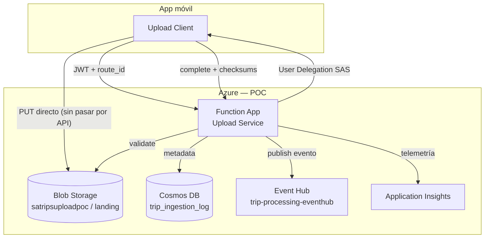
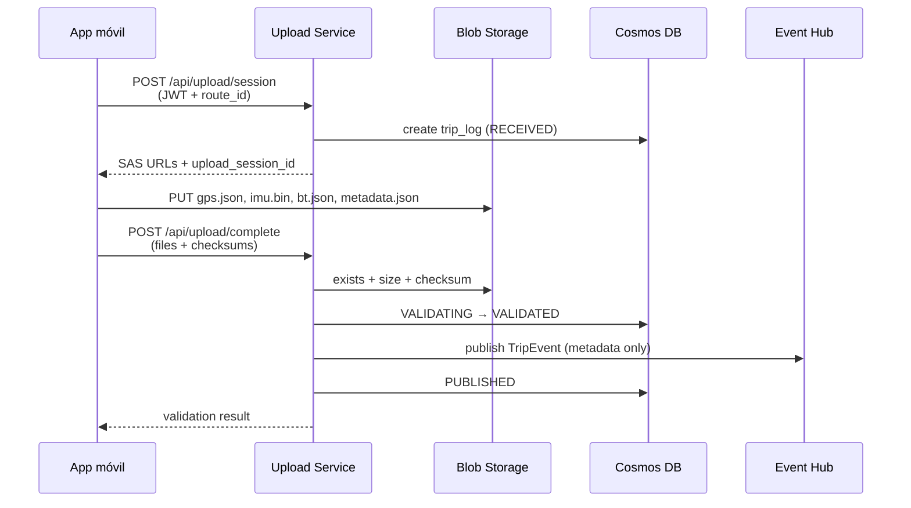

# Trips Upload POC

> Gateway serverless en Azure Functions para ingestión de viajes: SAS directo a Blob, metadata en Cosmos DB y publicación en Event Hub.

[](https://www.python.org/)
[](https://learn.microsoft.com/azure/azure-functions/)
[](https://docs.pydantic.dev/)
[]()

---

## Tabla de contenidos

- [El problema](#el-problema)
- [La solución](#la-solución)
- [Arquitectura](#arquitectura)
- [Flujo de upload](#flujo-de-upload)
- [Estructura del repositorio](#estructura-del-repositorio)
- [API](#api)
- [Stack tecnológico](#stack-tecnológico)
- [Requisitos previos](#requisitos-previos)
- [Inicio rápido](#inicio-rápido)
- [Stack local con Docker](#stack-local-con-docker)
- [Configuración](#configuración)
- [Azure](#azure)
- [Desarrollo](#desarrollo)
- [Testing](#testing)
- [Roadmap](#roadmap)
- [Documentación](#documentación)
- [Alcance del POC](#alcance-del-poc)

---

## El problema

Al finalizar un viaje, la app móvil genera archivos grandes (GPS, IMU, Bluetooth, metadata). Enviarlos por una API backend tradicional implica:

- Payloads pesados que saturan la Function App
- Timeouts y reintentos costosos
- Escalabilidad limitada
- Falta de trazabilidad end-to-end

## La solución

Un **Upload Service** que coordina la carga sin transportar archivos:

1. La app solicita una **sesión de upload** → recibe SAS URLs temporales (write-only, 15 min)
2. La app sube **directamente a Blob Storage** usando esas URLs
3. La app notifica **upload complete** → el backend valida integridad, persiste metadata y publica un evento

Los workers downstream (GPS, IMU, BT) consumen el evento desde Event Hub. **Este POC termina en la publicación del evento.**

---

## Arquitectura

### Vista de sistema



### Patrón interno: layered serverless

El código sigue una **arquitectura en capas** dentro de una sola Function App, usando **Blueprints** del modelo de programación v2 de Azure Functions:

| Capa | Ubicación | Responsabilidad |
|------|-----------|-----------------|
| **HTTP / Handlers** | `api/v1/` | Recibir requests, validar entrada, delegar |
| **Servicios** | `services/` | Lógica de negocio e integración con Azure |
| **Modelos** | `models/` | Contratos Pydantic (request/response/eventos) |
| **Config** | `config.py` | Settings desde variables de entorno |
| **Cross-cutting** | `shared/` | Logging estructurado, correlation ID |
| **Composición** | `function_app.py` | Registra blueprints — único entrypoint |

```
  api/v1/          services/         Azure SDK
  (blueprints)  →  (lógica)      →   Blob · Cosmos · Event Hub
       ↑                ↑
    models/         shared/ + config.py
```

Principios inmutables del proyecto: [`docs/constitution.md`](docs/constitution.md)

---

## Flujo de upload



### Estados del trip log (`trip_ingestion_log`)

```
RECEIVED → VALIDATING → VALIDATED → PUBLISHED → (downstream) PROCESSING → SUCCESS | FAILED
```

Partition key Cosmos DB: `/route_id`

---

## Estructura del repositorio

```
trips_upload/
├── function_app.py              # Entrypoint — registra blueprints api/v1
│
├── api/v1/                      # Capa HTTP (Azure Functions Blueprints)
│   ├── health.py                # GET  /api/health
│   ├── upload_session.py        # POST /api/upload/session
│   └── upload_complete.py       # POST /api/upload/complete
│
├── services/                    # Capa de lógica de negocio
│   ├── auth.py                  # JWT mock validation
│   ├── blob_storage.py          # SAS, exists, properties
│   ├── cosmos_db.py             # trip_ingestion_log CRUD
│   └── event_hub.py             # publish_trip_event
│
├── models/                      # Schemas Pydantic v2
│   ├── session.py
│   ├── complete.py
│   ├── trip_log.py
│   └── trip_event.py
│
├── config.py                    # Settings (env vars)
├── shared/
│   ├── logging.py               # Logging estructurado
│   └── correlation.py           # correlation_id
│
├── tests/
│   ├── unit/
│   ├── integration/
│   └── e2e/
│
├── docs/                        # Documentación del proyecto
├── host.json
├── requirements.txt
└── local.settings.json.example
```

### Composición de blueprints

`function_app.py` es el único punto de entrada. Cada endpoint vive en su propio módulo:

```python
import azure.functions as func

from api.v1.health import health_bp
from api.v1.upload_session import bp as upload_session_bp
from api.v1.upload_complete import bp as upload_complete_bp

app = func.FunctionApp()

app.register_functions(health_bp)
app.register_functions(upload_session_bp)
app.register_functions(upload_complete_bp)
```

Para agregar un endpoint: crear `api/v1/<nombre>.py` con un `bp = func.Blueprint()` y registrarlo en `function_app.py`.

---

## API

| Método | Ruta | Descripción | Estado |
|--------|------|-------------|--------|
| `GET` | `/api/health` | Liveness probe | ✅ Implementado |
| `POST` | `/api/upload/session` | Crear sesión, SAS URLs, trip log | 🚧 T08+ |
| `POST` | `/api/upload/complete` | Validar blobs, publicar evento | 🚧 T09+ |

### Autenticación (POC)

Todos los endpoints de upload requieren header:

```
Authorization: Bearer <jwt_mock_token>
```

En POC se usa JWT mock configurable (`JWT_MOCK_SECRET`). Evolución prevista: Auth0, Firebase o Microsoft Entra ID.

### Convención de blobs

```
landing/source={source}/year={YYYY}/month={MM}/day={DD}/{timestampZulu}_{userId}_{routeId}_{source}.{ext}
```

Fuentes: `gps`, `imu`, `bt`, `metadata`. El cliente **no construye rutas** — las recibe en la respuesta de session.

---

## Stack tecnológico

| Componente | Tecnología |
|------------|------------|
| Runtime | Python 3.13 |
| Compute | Azure Functions v4 (Consumption) |
| HTTP model | Blueprints (programming model v2) |
| Blob | Azure Blob Storage + User Delegation SAS |
| Metadata | Azure Cosmos DB (SQL API) |
| Messaging | Azure Event Hub |
| Models / Config | Pydantic v2 · pydantic-settings |
| Auth (POC) | JWT mock |
| Observabilidad | Application Insights + logging estructurado |
| Testing | pytest |
| Credenciales | Managed Identity (Azure) |

---

## Requisitos previos

- **Python 3.13**
- **[Azure Functions Core Tools v4](https://learn.microsoft.com/azure/azure-functions/functions-run-local)**
- **Cuenta Azure** con recursos del POC (ver checklist abajo)
- Opcional local: [Azurite](https://learn.microsoft.com/azure/storage/common/storage-use-azurite) para emular Blob Storage

---

## Inicio rápido

```bash
# 1. Clonar e instalar dependencias
git clone <repo-url>
cd trips_upload
python3.13 -m venv .venv
source .venv/bin/activate      # Windows: .venv\Scripts\activate
pip install -r requirements.txt

# 2. Configuración local
cp local.settings.json.example local.settings.json
# Editar local.settings.json con tus valores de Azure

# 3. Levantar la Function App
func start

# 4. Smoke test
curl http://localhost:7071/api/health
# → {"status":"ok","service":"trips-upload-poc"}
```

---

## Stack local con Docker

El proyecto soporta dos entornos de ejecución seleccionables por variables de entorno. No se necesita modificar código para cambiar entre ellos.

### Routing por entorno

| Variable | `local` | `production` |
|----------|---------|-------------|
| `ENVIRONMENT` | `local` | `production` |
| **Blob Storage** | Azurite (Docker) | Azure Blob Storage + MI |
| **Cosmos DB** | Cosmos emulator (Docker) | Azure Cosmos DB + MI |
| **Mensajería** | Apache Kafka (Docker) | Azure Event Hub + MI |
| `USE_AZURITE` | `true` | no seteada |
| `KAFKA_BOOTSTRAP_SERVERS` | `localhost:9092` | — (no se usa) |
| `EVENTHUB_FULLY_QUALIFIED_NAMESPACE` | — (no se usa) | `{ns}.servicebus.windows.net` |

En `production`, todos los servicios de Azure usan **Managed Identity** — sin claves ni connection strings en el código.

### Levantar el stack local

```bash
# Copiar template de variables
cp .env.local.example .env

# Levantar todos los servicios
docker compose up -d
```

Servicios incluidos en `docker-compose.yml`:

| Contenedor | Imagen | Puerto | Función |
|-----------|--------|--------|---------|
| `trips-azurite` | `mcr.microsoft.com/azure-storage/azurite` | `10000` | Blob Storage emulator |
| `trips-cosmos` | `mcr.microsoft.com/cosmosdb/linux/azure-cosmos-emulator` | `8081` | Cosmos DB emulator (QEMU x86) |
| `trips-cosmos-ui` | `nginx:alpine` | `8082` | Redirect al Cosmos Explorer |
| `trips-kafka` | `apache/kafka` | `9092` | Kafka broker (KRaft, ARM64 nativo) |
| `trips-kafka-ui` | `provectuslabs/kafka-ui` | `8090` | Kafka web UI |

### UIs de los servicios

| Servicio | URL | Notas |
|----------|-----|-------|
| **Cosmos Explorer** | `https://localhost:8081/_explorer/index.html` | Aceptar cert auto-firmado en el browser |
| *(shortcut)* | `http://localhost:8082` | Redirect automático al Explorer |
| **Kafka UI** | `http://localhost:8090` | Topics, mensajes, consumer groups |

> En Docker Desktop, los puertos `8082` y `8090` son clickeables y abren las UIs directamente.

### Verificar que el stack está listo

```bash
# Cosmos — devuelve 200 cuando está listo (~60s en arrancar)
curl -sk -o /dev/null -w "%{http_code}" https://localhost:8081/_explorer/index.html

# Kafka — lista topics
docker exec trips-kafka /opt/kafka/bin/kafka-topics.sh \
  --bootstrap-server localhost:9092 --list

# Azurite — verifica el blob endpoint
curl -s -o /dev/null -w "%{http_code}" http://localhost:10000/devstoreaccount1
```

### Levantar la Function App en modo local

```bash
# Con el stack de Docker corriendo:
func start
```

La Function App lee las variables de `.env` (o `local.settings.json`) y usa automáticamente los emuladores locales con `ENVIRONMENT=local`.

---

## Configuración

Variables en `local.settings.json` (local) o **Application Settings** (Azure):

**Routing de entorno**

| Variable | Descripción | Local | Producción |
|----------|-------------|-------|-----------|
| `ENVIRONMENT` | Entorno activo | `local` | `production` |
| `USE_AZURITE` | Activar Azurite para blob | `true` | *(omitir)* |

**Blob Storage**

| Variable | Descripción | Ejemplo |
|----------|-------------|---------|
| `AzureWebJobsStorage` | Runtime Functions + Azurite conn string | Connection string |
| `STORAGE_ACCOUNT_NAME` | Cuenta Blob (prod) | `satripsuploadpoc` |
| `STORAGE_CONTAINER` | Container de landing | `landing` |

**Cosmos DB**

| Variable | Descripción | Ejemplo |
|----------|-------------|---------|
| `COSMOS_ENDPOINT` | URI Cosmos DB | `https://….documents.azure.com:443/` |
| `COSMOS_DATABASE` | Database | `trips` |
| `COSMOS_CONTAINER` | Container metadata | `trip_ingestion_log` |

**Mensajería**

| Variable | Descripción | Entorno |
|----------|-------------|---------|
| `KAFKA_BOOTSTRAP_SERVERS` | Broker Kafka local | `local` |
| `KAFKA_TOPIC` | Topic de eventos | `local` |
| `EVENTHUB_NAME` | Event Hub | `production` |
| `EVENTHUB_FULLY_QUALIFIED_NAMESPACE` | Namespace FQDN | `production` |

**Auth y observabilidad**

| Variable | Descripción |
|----------|-------------|
| `JWT_MOCK_SECRET` | Secreto JWT POC |
| `SAS_TTL_MINUTES` | Expiración SAS (minutos) |
| `APPLICATIONINSIGHTS_CONNECTION_STRING` | Telemetría App Insights |

En Azure se usa **Managed Identity** para Blob, Cosmos y Event Hub — nunca Storage Keys en producción.

Templates: [`local.settings.json.example`](local.settings.json.example) · [`.env.local.example`](.env.local.example)

---

## Azure

Recursos necesarios y orden de creación en Portal:

📋 **[docs/azure-portal-checklist.md](docs/azure-portal-checklist.md)**

Resumen:

| Recurso | Nombre sugerido |
|---------|-----------------|
| Resource Group | `rg-g2k-suite-labs` |
| Storage Account | `satripsuploadpoc` |
| Cosmos DB | SQL API · DB `trips` · container `trip_ingestion_log` |
| Event Hub | `backendnodeeventhub` / `trip-processing-eventhub` |
| Application Insights | `ai-trips-upload-poc` |
| Function App | `func-trips-upload-poc` · Python 3.13 · Linux |

Roles Managed Identity: **Storage Blob Data Contributor**, **Cosmos DB Built-in Data Contributor**, **Azure Event Hubs Data Sender**.

---

## Desarrollo

### Convenciones

- Contratos tipados con **Pydantic** — no `dict` sueltos
- **Logging estructurado** — no `print()`
- **`correlation_id`** en logs, eventos y metadata
- Config vía **env / Settings** — nada hardcodeado
- Handlers delgados en `api/v1/` — lógica en `services/`

### Agregar un endpoint

1. Crear `api/v1/mi_endpoint.py`:

```python
import azure.functions as func

bp = func.Blueprint()

@bp.route(route="mi/ruta", methods=["POST"])
def mi_handler(req: func.HttpRequest) -> func.HttpResponse:
    ...
```

2. Registrar en `function_app.py`:

```python
from api.v1.mi_endpoint import bp as mi_bp
app.register_functions(mi_bp)
```

### Fases de implementación

Ver detalle completo en [`docs/implementation-plan.md`](docs/implementation-plan.md):

| Fase | Tasks | Estado |
|------|-------|--------|
| 1 — Infra Azure | T01–T03 | Pendiente (Portal) |
| 2 — Scaffold | T04–T06 | ✅ Completo |
| 3 — Modelos | T07 | ✅ Completo |
| 4 — Servicios core | T08–T11 | ✅ Completo |
| 5 — Endpoints HTTP | T12–T13 | ✅ Completo |
| 6 — Observabilidad | T14–T15 | ✅ Completo |
| 7 — E2E + docs | T16–T18 | ✅ Completo |

---

## Testing

```bash
pip install -r requirements-dev.txt

# Todos los tests
pytest

# Por capa
pytest tests/unit -v
pytest tests/integration -v
pytest tests/e2e -v
```

Estrategia: **TDD** con pytest — unit tests para servicios y modelos, integration tests contra Azurite/emuladores, E2E contra Azure lab.

---

## Documentación

| Documento | Contenido |
|-----------|-----------|
| [`docs/constitution.md`](docs/constitution.md) | Reglas inmutables del proyecto |
| [`docs/poc-architecture.md`](docs/poc-architecture.md) | Requisitos funcionales y no funcionales |
| [`docs/technical-plan.md`](docs/technical-plan.md) | Diseño técnico detallado |
| [`docs/implementation-plan.md`](docs/implementation-plan.md) | Tasks T01–T18 |
| [`docs/azure-portal-checklist.md`](docs/azure-portal-checklist.md) | Checklist infra Azure |
| [`docs/runbook.md`](docs/runbook.md) | Setup local, curl demo, deploy |
| [`docs/history.md`](docs/history.md) | Historial de commits |

---

## Alcance del POC

**Incluido**

- Sesión de upload con SAS User Delegation
- Carga directa a Blob por la app móvil
- Validación de integridad (size + checksum)
- Metadata en Cosmos DB (`trip_ingestion_log`)
- Publicación de evento metadata-only en Event Hub
- Observabilidad básica (App Insights + logs estructurados)

**Fuera de alcance**

- Workers GPS / IMU / BT (consumidores Event Hub)
- Auth real (Auth0 / Entra) — solo JWT mock
- Terraform / IaC automatizado
- App móvil y lógica de reintentos del cliente
- Procesamiento de payloads binarios en la API

---

## Licencia

POC interno — G2K Suite Labs.
