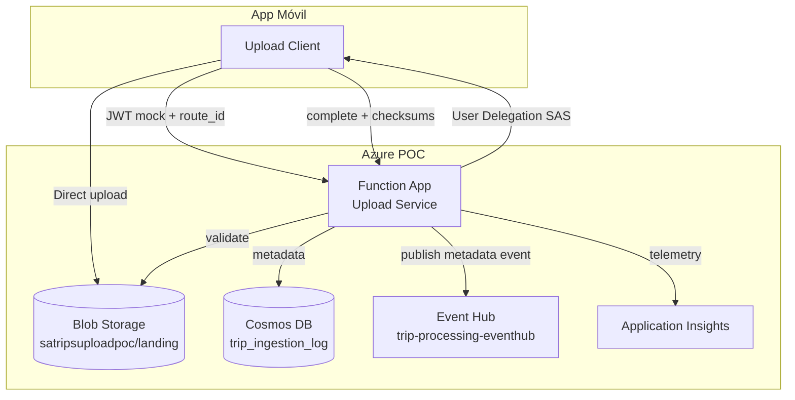

# Technical Plan: trips-upload-poc

**Task ID:** trips-upload-poc  
**Status:** Ready for Implementation  
**Based on:** spec.md, constitution.md  
**Created:** 2026-05-22  
**Version:** 1.0

---

## 1. System Architecture



### Architecture Decisions (frozen)

| Decision | Choice | Rationale |
|----------|--------|-----------|
| Auth POC | JWT mock | Evolución: Auth0, Firebase, Entra |
| File storage | Azure Blob Storage | Direct upload via SAS |
| Metadata | Cosmos DB `trip_ingestion_log`, PK `/route_id` | Separación metadata/archivos (constitution §4.3) |
| Messaging | Azure Event Hub existente | Decisión temporal SDD §14 |
| Backend | Azure Functions Python | Stack SDD §13 |
| Infra provisioning | Portal / Azure CLI manual | No Terraform |
| POC boundary | Ends at Event Hub publish | Workers out of scope |
| Credentials | Managed Identity default | Constitution §3.3 |

## 2. Technology Stack

| Layer | Technology | Rationale |
|-------|------------|-----------|
| Runtime | Python 3.11+ | SDD stack |
| Functions | Azure Functions v4 (Python model) | HTTP triggers |
| Blob | azure-storage-blob + User Delegation SAS | FR-2, FR-3 |
| Metadata | azure-cosmos | implementation-plan §2 |
| Event Hub | azure-eventhub | FR-6 |
| Models | Pydantic v2 | Constitution §5.1 |
| Config | pydantic-settings | Constitution §8.1 |
| Auth POC | JWT mock service | implementation-plan §2 |
| Observability | Application Insights + structured logging | Constitution §6 |
| Testing | pytest | implementation-plan §8 |
| Local dev | Azure Functions Core Tools | SDD §13 |

## 3. Repository Structure

```
trips_upload/
├── function_app.py                 # Entrypoint — registers api/v1 blueprints
├── api/
│   └── v1/
│       ├── health.py               # GET /api/health
│       ├── upload_session.py       # POST /api/upload/session
│       └── upload_complete.py      # POST /api/upload/complete
├── services/
│   ├── blob_storage.py             # SAS, exists, properties
│   ├── cosmos_db.py                # trip_ingestion_log CRUD
│   ├── event_hub.py                # publish_trip_event
│   └── auth.py                     # JWT mock validation
├── models/
│   ├── session.py
│   ├── complete.py
│   ├── trip_log.py
│   └── trip_event.py
├── config.py                       # Settings (env vars)
├── shared/
│   ├── logging.py
│   └── correlation.py
├── tests/
│   ├── unit/
│   ├── integration/
│   └── e2e/
├── docs/
│   ├── constitution.md
│   ├── poc-architecture.md
│   ├── implementation-plan.md
│   └── azure-portal-checklist.md
├── host.json
├── requirements.txt
├── local.settings.json.example
└── README.md
```

## 4. Component Design

### 4.1 upload_session function
- Validate JWT mock (`auth_service`)
- Generate `correlation_id`, `upload_session_id`
- Build blob paths via `BlobStorageService`
- Generate SAS (write-only, 15 min)
- Create trip log in Cosmos (`CosmosService.create_trip_log`, status=RECEIVED)
- Return `UploadSessionResponse`

### 4.2 upload_complete function
- Validate JWT mock
- Load trip log by session
- For each file: `blob_exists`, `get_blob_properties`, verify size + checksum
- Update Cosmos: VALIDATING → VALIDATED or FAILED
- If VALIDATED: `EventHubService.publish_trip_event`, status=PUBLISHED
- Return validation result

### 4.3 BlobStorageService
| Method | Purpose |
|--------|---------|
| `generate_sas(blob_path, ttl_minutes)` | User Delegation SAS write-only |
| `blob_exists(blob_path)` | Existence check |
| `get_blob_properties(blob_path)` | Size for validation |
| `download_blob(blob_path)` | Optional checksum verify |
| `upload_blob(blob_path, data)` | Testing / admin only |

### 4.4 CosmosService
| Method | Purpose |
|--------|---------|
| `create_trip_log(trip_log)` | Session start |
| `update_trip_log(route_id, session_id, **fields)` | Status transitions |
| `get_trip_log(route_id, session_id)` | Load for complete |
| `trip_exists(route_id, session_id)` | Idempotency check |

### 4.5 EventHubService
| Method | Purpose |
|--------|---------|
| `publish_trip_event(trip_event: TripEvent)` | Metadata-only event |

### 4.6 AuthService (POC)
| Method | Purpose |
|--------|---------|
| `validate_jwt(token) -> user_id` | Mock validation for POC |

## 5. API Contracts

### POST /api/upload/session

**Request:**
```json
{ "route_id": "route123" }
```

**Response 201:** (see spec.md FR-2)

### POST /api/upload/complete

**Request:**
```json
{
  "route_id": "route123",
  "upload_session_id": "sess_9f2a1c",
  "files": [
    { "name": "gps.json", "size": 12345, "checksum": "abc..." },
    { "name": "imu.bin", "size": 67890, "checksum": "def..." },
    { "name": "bt.json", "size": 1111, "checksum": "ghi..." },
    { "name": "metadata.json", "size": 500, "checksum": "jkl..." }
  ]
}
```

## 6. Data Models (Pydantic)

### UploadSessionResponse
```python
class UploadSessionResponse(BaseModel):
    upload_session_id: str
    route_id: str
    user_id: str
    correlation_id: str
    expires_at: datetime
    uploads: dict[str, UploadTarget]  # source → {blob_path, sas_url}
```

### UploadCompleteRequest
```python
class UploadCompleteRequest(BaseModel):
    route_id: str
    upload_session_id: str
    files: list[FileDescriptor]
```

### TripLog (Cosmos document)
```python
class TripLog(BaseModel):
    id: str
    route_id: str
    correlation_id: str
    upload_session_id: str
    status: str
    validation_status: str | None
    created_at: datetime
    gps_exists: bool
    imu_exists: bool
    bt_exists: bool
    metadata_exists: bool
```

### TripEvent (Event Hub payload)
```python
class TripEvent(BaseModel):
    event_id: str
    correlation_id: str
    trip_id: str
    route_id: str
    user_id: str
    upload_session_id: str
    trip_date: str
    uploaded_at: datetime
    available_sources: list[str]
    trip_storage_root: str
    trip_file_prefix: str
```

## 7. Security (constitution-aligned)

- JWT mock en POC; Bearer required
- SAS: write-only, scoped paths, 15 min
- Managed Identity para Blob, Cosmos, Event Hub en Azure
- Secrets en `local.settings.json` / Key Vault — nunca en código
- Validación Pydantic en boundary HTTP

## 8. Observability

```python
logger.info({
    "route_id": route_id,
    "correlation_id": correlation_id,
    "operation": "upload_complete",
    "status": "SUCCESS"
})
```

App Insights: dependencies (Blob, Cosmos, Event Hub), exceptions, custom metrics.

## 9. Implementation Phases

| Phase | Scope |
|-------|-------|
| 1 | Infraestructura Azure |
| 2 | Upload Service (endpoints) |
| 3 | BlobStorageService |
| 4 | CosmosService |
| 5 | EventHubService |
| 6 | Observabilidad |
| 7 | Pruebas E2E |

## 10. Testing Strategy

| Type | Scope |
|------|-------|
| Unit | JWT mock, SAS gen, checksum, Cosmos, Event Hub serializers |
| Integration | Upload Service + Blob; + Cosmos; + Event Hub |
| E2E | Login mock → SAS → upload → complete → Cosmos → Event Hub → logs |

## 11. Risks

| Risk | Mitigation |
|------|------------|
| User Delegation SAS setup | Document MI + Storage Blob Data Contributor |
| Cosmos partition hot route_id | Acceptable for POC |
| Event Hub permissions | Test publish early phase 5 |
| JWT mock ≠ production | Document evolution path |

## 12. Configuration (local.settings.json.example)

```json
{
  "Values": {
    "AzureWebJobsStorage": "UseDevelopmentStorage=true",
    "STORAGE_ACCOUNT_NAME": "satripsuploadpoc",
    "STORAGE_CONTAINER": "landing",
    "COSMOS_ENDPOINT": "https://...",
    "COSMOS_DATABASE": "trips",
    "COSMOS_CONTAINER": "trip_ingestion_log",
    "EVENTHUB_NAME": "trip-processing-eventhub",
    "EVENTHUB_CONNECTION": "<or use MI>",
    "JWT_MOCK_SECRET": "poc-dev-secret",
    "JWT_MOCK_USER_ID": "user456",
    "SAS_TTL_MINUTES": "15",
    "APPLICATIONINSIGHTS_CONNECTION_STRING": "..."
  }
}
```

## 13. Definition of Done

- [ ] Recursos Azure creados
- [ ] Upload Service funcional (session + complete)
- [ ] SAS generado; upload directo funcional
- [ ] Validación integridad funcional
- [ ] Cosmos DB funcional
- [ ] Evento publicado en Event Hub
- [ ] Logs visibles en App Insights
- [ ] Pruebas E2E exitosas
- [ ] Documentación actualizada

---

**Next:** `tasks.md` → implement with Superpowers TDD

*Plan created with SDD 5.1*
